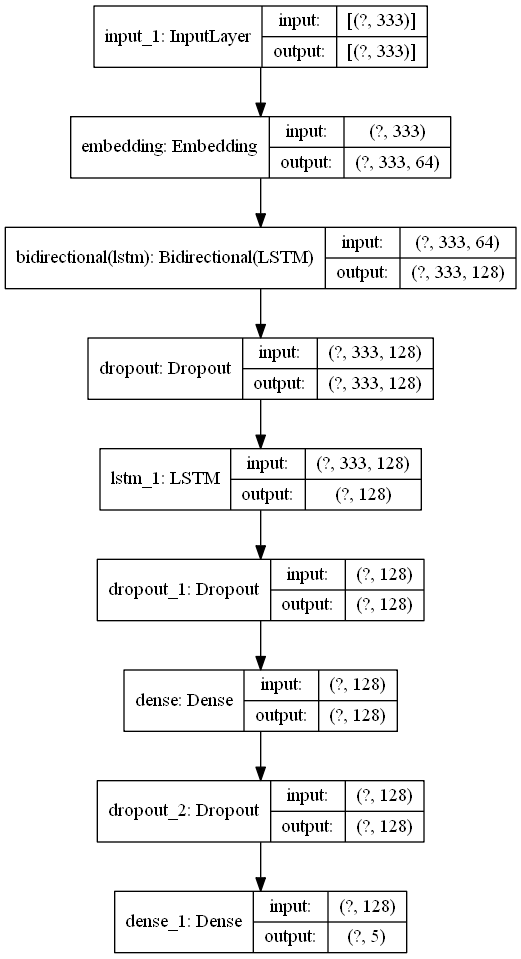
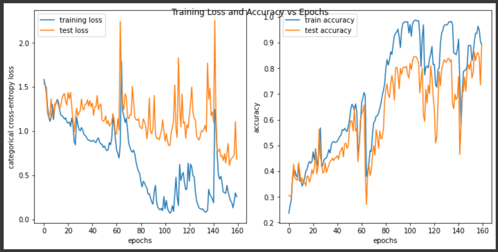
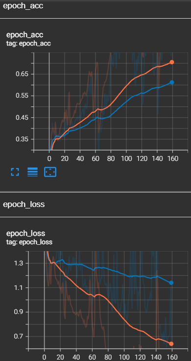
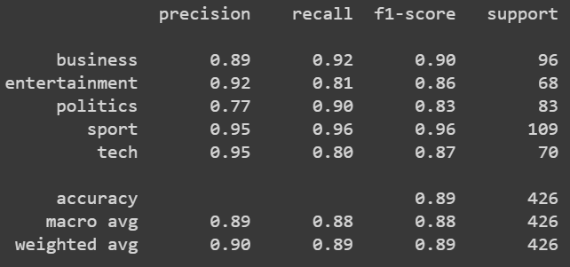
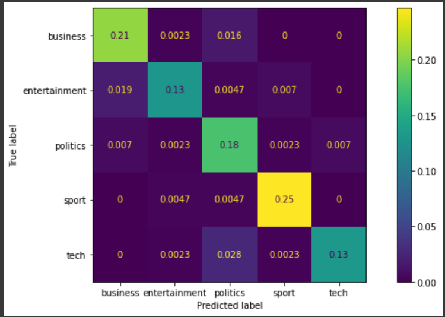

# Project: Article/Texts Categorization

# Description
The project is about developing a deep learning model to categorize newly received articles into either one of the five categories (sport, technology, business, entertainment, politics). This is done by training a NLP deep learning model on one of [BBC text data](https://raw.githubusercontent.com/susanli2016/PyCon-Canada-2019-NLP-Tutorial/master/bbc-text.csv). The main layer of the NLP deep learning model is the bi-directional LSTM layer that is inputted with the forementioned text data, containing 2000+ articles that is labelled according to the five categories mentioned earlier.

# How to Install and Run the Project
To run and train the model on your own device, clone the whole repository first. Then, proceed to the directory containing the cloned repository. In this particular directory, locate the `nlp.py` file and run this file in your terminal or any of your favorite IDEs. This will generate all the relevant plots and results especially the trained NLP deep learning model.

# Results
## Neural Network Model Plot

## Model Training/Test Loss and Metrics (Accuracy)
### Matplotlib Plot

### Smoothed Tensorboard Plot

## Model Performance on The Test/Out-of-Sample Dataset
### Classification Report

### Confusion Matrix

# Credits
- [BBC Text Data](https://raw.githubusercontent.com/susanli2016/PyCon-Canada-2019-NLP-Tutorial/master/bbc-text.csv)
- [Markdown badges source 1](https://github.com/Ileriayo/markdown-badges)
- [Markdown badges source 2](https://github.com/alexandresanlim/Badges4-README.md-Profile)